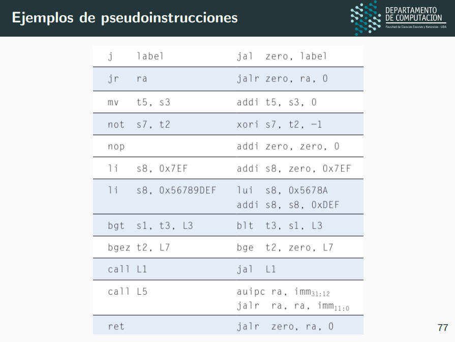

# Arquitectura de un procesador: 
Son las instrucciones, los registros y la forma de acceder a memoria.
Interactuamos con la arquitectura escribiendo un programa en un lenguaje ensamblador (lenguaje que el procesador entiende).
Se compone de:
- Un conjunto de instrucciones,
- Un conjunto de registros,
- La forma de acceder a memoria.
Un ejemplo de arquitectura es RISCV.

## No es arquitectura de un procesador:
La implementacion especifica del procesador que permite ejecutar estos programas. 
Puede haber varias implementaciones de una misma arquitectura intercambiables siempre y cuando respeten lo que la arquitectura define.

## Lenguajes de alto nivel vs bajo nivel
- <b>Alto nivel:</b> Se expresan en un dominio independiente a la arquitectura del procesador donde se corre el programa.
    
    Proveen un nivel de abstraccion basado en variables, estructuras de control y un mecanismo para invocar/llamar funciones.
    
    Para esto, los procesadores necesitan se acompañados por programas de compilado, ensamblado y enlazado.
    
    Cuando traducimos un programa de un lenguaje de alto nivel a ensamblador debemos decidir en quee registros almacenar los valores de nuestras variables.

- <b>Bajo nivel:</b> Los procesadores pueden ejecutar instrucciones escritas en un lenguaje en particular, que conoce su arquitectura y se expresa estrictamente en terminos de sus componentes (instrucciones, registros y memoria). Este es el lenguaje ensamblador de esta arquitectura RISC V en nuestro caso.

# Arquitectura RISC V:
Es una arquitectura abierta, modular y de uso industrial.
Se compone de:

## Instrucciones:
 
    ESTRUCTURA DE LAS INSTRUCCIONES:

    Tienen la forma "mnemonico | operando destino | operandos fuente"
    Donde:
    - mnemonico: indica el tipo de operacion a realizar.
    - operando destino: registro donde se almacena el resultado.
    - operandos fuente: registros utilizados en la operacion.

    PROPIEDADES:
    * No pueden ser instrucciones compuestas, sino que son atomicas.
    * La operaciones logico aritmeticas modifican el estado del procesador segun su semantica, dichas modificaciones deben realizarse rapidamente
    debido a que constistutyen el grueso del computo que ocurre en nuestros procesadores. Es por esto que los operandos de fuente y destino suelen ser registros.

    INMEDIATOS:
    Ademas, las instrucciones en lenguaje ensamblador pueden tener valores constantes como operandos (valores inmediatos).
    Estos valores son de 12 bits y se extiende su signo a 32 bits antes de operar.
    Si queremos cargar un valor inmediato de 32 bits esto se divide en dos pasos.

    EJEMPLO 1:
    - Cargar los 20 bits superiores (lui s2 0xABCDE)
    - Cargar los 12 bits inferiores (addi s2 s2 0x123)
    Este ejemplo carga (s2 = 0xABCDE123 <-- esto es en HEX, en binario tiene 32 bits).

    EJEMPLO 2 (parte baja negativa):
    - lui s2 0xFEEDB (aca, para compensar el efecto de la extension del signo en la suma abajo, incrementamos en uno la parte alta)
    - addi s2 s2 -1657
    En este ejemplo carga (s2 = 0xFEEDA987) 

    Tipos de instrucciones:

## Registros:

    RISC V tiene 32 registros que suelen implementarse como un arreglo de memoria estatica de 32 bits con varios puertos, al cual se denomina register file.
    Los registros (x0, ..., x32) tienen alias.

    x0: almacena siempre el 0 y no puede ser escrito
    s0 a s11, t0 a t6: almacenan variables
    ra y de a0 a a7: usados en las llamadas a funcion

## Memoria:

    Se estructura y accede como si fuera un arreglo de elementos de 32 bits (4 bytes).

    El acceso a memoria es mas lento que el acceso a registros pero nos permite acceder a mas informacion que solo los 32 registros.
    
    El acceso a memoria es a traves de indices que apuntan a uno de los 4 bytes de una palabra cualquiera. 
    Entre una palabra de 32 bits y otra, los indices avanzan en 4 unidades. 
    
    La lectura y escritura se hace en base a un byte en particular.

    Direcciones: 
    word adress = 4 * word number
    Se definen como direccion = base + desplazamiento
    donde base es el valor de un registro y desplazamiento una constante con signo de 12 bits
    
    EJEMPLO: Sea a=s7, mem=s3
    Cod. C                Cod. RISC V
    int a = mem[2];       lw s7 8(s3)

    Cod. C                Cod. RISC V
    mem[5] = 33;          addi t3, zero, 33
                          sw t3 20(s3) # porque 5 palabras * 4 bytes = 20 desplazamientos

    # Acceso de memoria para un elemento de un arreglo:
    La forma de acceder al i-esimo elemento es cargando el dato que se encuentra en base + tamano * indice,
    Por ej. si queremos acceder al elemento 199 seria buscandolo en 
    0x174300A0 + 4 * 198 = 0x174303B8

    # Division de la memoria:
    Se divide en:
    - Dynamic Data: aca estan el stack (en las direcciones altas) y el heap (estructura que permite hacer un pedido explicito de memoria sin usar el stack).
    - .data: aca viven las variables y constantes globales.
    - .text: aca guardamos las instrucciones en binario.
    - Operating System & I/O.
    - Exception Handlers.

    # PILA
    La pila es una parte de la memoria que se utiliza para almacenar informacion temporaria, se utiliza con un esquema LIFO (el ultimo elemento ingresado es el primero en retirarse), como una pila de valores. La semantica de uso es a traves de operacion de agregado (push) y retiro (pop) de un elemento (tope) de la pila. La pila suele comenzar en las direcciones altas de la memoria y va tomando (con cada push) las direcciones inmediatamente m´as bajas. Por eso se suele decir que la pila crece hacia abajo.

    # LSB
    La arquitectura RISC V permite acceder a la memoria con direcciones que refieren al byte menos significativo a partir del cual leer o escribir la palabra.

    MSB vs LSB: Para entender completamente qué es el byte menos significativo, necesitamos hablar de "endianess". La endianess determina cómo se almacenan y se interpretan los bytes de una palabra en la memoria. Existen dos tipos principales de endianess:
    - Big-endian: El byte más significativo (MSB, Most Significant Byte) se almacena en la dirección de memoria más baja.
    - Little-endian: El byte menos significativo (LSB, Least Significant Byte) se almacena en la dirección de memoria más baja.
    
    RISC-V utiliza la convención little-endian por defecto, aunque también puede soportar big-endian.

    Ejemplo de Little-endian:
    word   mem. dir: |0x00|0x01|0x02|0x03| (byte 0, 1, 2, 3)
    0x12345678 --->  |0x78|0x56|0x34|0x12|    

    Aca el LSB (bute menos significativo) es 0x78 porque contiene los bits de menor peso.

# Programas en RISC V

## Programa almacenado en memoria: 

    Las instrucciones que desciben el comportamiento de un programa se almacenan en la memoria del procesador, la misma que se accede en sw/lw, pero con un formato particular.

    Cada instruccion ocupa 32 bits (4 bytes), es decir, una palabra. Por este motivo las direcciones se incrementan en multiplos de 4.

    El procesador ejecuta el programa almacenando la posicion de memoria de la instruccion ejecutada en el PC (un registro).

    El procedimiento es:
    Fetch (cargar el contenido de la instruccion de memoria) >> Execute (ejecutarla) >> PC+=4

### Instrucciones Logicas:
- <b>or</b>: Util para combinar dos registros que solo tienen asignada la parte alta y baja respectivamente, un or entre 0xFEED0000 y 0x0000F0CA resulta en 0xFEEDF0CA.
- <b>and</b>: Nos permite limpiar partes de un registro, si quisieramos preservar solamente la parte baja de 0xBABAC0C0 podemos hacer un and con 0x0000FFFF consiguiendo 0x0000C0C0
- <b>xor</b>:  Conseguir la negacion logica al aplicar la operacion a -1, recordemos que -1 se codifica con todos 1, por lo que xori s1, s2, -1 va a aplicar un xor entre s2 y -1 que se codifica como 0xFFF en 12 bits y se extiende a 0xFFFFFFFF al ejecutar, consiguiendo un xor contra todos unos, que efectivamente niega el valor.
- [Extra] <b>slt</b>: slt x7, x5, x6   # x7 = (x5 < x6) ? 1 : 0

### Instrucciones de desplazamiento:
- <b>sll</b> (shift-left-logical): desplaza a izquierda el valor tantas veces como especifique el segundo operando fuente, complementando con 0s a derecha.
- <b>srl</b> (shift-right-logical): desplaza a derecha el valor tantas veces como especifique el segundo operando fuente, completando con 0s izquierda.
- <b>sra</b> (shift-right-arithmetic): desplaza a derecha el valor tantas veces como especifique el segundo operando fuente, completando con el valor delbit mas significativo a izquierda.
Existen tambien:
- <b>slli</b>: (multiplicacion) por ej. slli a0 a0 1 ---> a0 = 2*a0 
- <b>srli</b>: (division sin signo) por ej. 
- <b>srai</b>. (division con signo) por ej. srai a0 a0 1 ---> a0 = a0/2

Podemos acceder a un byte particular de una palabra de la siguiente forma:
~~~
# Sea s1=0xABCDEF00 y supongamos queremos el segundo byte desde el LSB y almacenarlo en s2

srli t0 s1 8            # srli t0 "0x12345678" 8 --> t0=0x00123456
andi s2 t0 0xFF         # andi s2 "0x00123456" 0x000000FF --> s2=0x00000056

# Idea:
# 1. Desplaza el contenido de s1 8 bits a la derecha, moviendo el tercer byte desde la izquierda a la posición del byte menos significativo.
# 2. Aplica una máscara AND con 0xFF para aislar el byte menos significativo del resultado desplazado, almacenándolo en s2.
~~~

### Instrucciones de control de flujo:
- <b>beq(branch if equal)</b>: que reemplaza el valor del PC si los dos primeros operandos son iguales.
- <b>bne(branch if not equal)</b>: que reemplaza el valor del PC si los dos primeros operandos son distintos.
- <b>blt(branch if less than)</b>: que reemplaza el valor del PC si el primer operando es menor que el segundo.
- <b>bge(branch if greater than or equal)</b>: que reemplaza el valor del PC si el primer operando es mayor o igual que el segundo.
- <b>bgt(branch if greather than)</b>.
- Sin signo: Existen <b>bltu, gbeu</b>.

### Saltos incondicionales:
- <b>j (jump)</b>: que simplemente actualiza el valor del PC con el del operando provisto (inmediato de 20 bits extendidos en signo a 32).
- <b>jal (jump and link)</b>: que almacena el valor actual del PC en el registro indicado en el primer operando y actualiza el valor del PC con el del segundo operando (inmediato de 20 bits extendidos en signo a 32).

### Llamadas a funciones:
- La funcion llamada no debe interferir con el estado de la funcion llamadora, debido a esto debe respetar los valores de los registros guardados (s0 a s11) y el registro de la direccion de retorno (ra), que indica como retornar la ejecucion a la funcion llamadora.
- Esto significa que se preserva parte del estado del procesador entre el llamado y el retorno.
- Tambien debe mantenerse invariante la porcion de memoria (stack) correspondiente a funcion llamadora.
- El sp (stack pointer) es el registro encargado de guardar la direccion tope de la pila.

|Preserved (callee-saved) | Nonpreserved (caller-saved) |
|-----------------------  | ----------------------------|
|Saved registers: s0-s11  | Temporary registes: t0-t6   |
|Return adress: ra        | Argument registers: a0-a7   |
|Stack pointer: sp        |                             |
|Stack above the sp       | Stack below the sp          | 

Stack Above SP: The stack above sp holds critical information such as return addresses, saved register values, and local variable. 

Stack Below SP: The stack below sp typically contains function parameters and temporary variables that are not required after the function call.

Al espacio de la pila utilizado por la llamada en cuestion lo llamamos marco de pila o stack frame.

### Reglas de preservacion de estado

#### [1] Regla para la llamadora: 
- Antes de Llamar: Antes de realizar una llamada a una función, la llamadora debe guardar los valores de los registros temporarios que necesitará después de que la función retorne. Estos registros temporarios son t0 a t6 y a0 a a7.

- - Ejemplo: Si la llamadora necesita usar t0, t1 y a0 después de que la función retorne, deberá guardar estos valores en el stack antes de llamar a la función.

#### [2] Regla para la llamada:

- Si va a Utilizar Registros Permanentes: Si una función va a utilizar los registros permanentes (s0 a s11, ra), debe guardarlos al comienzo de la función y restaurarlos antes de retornar.

- - Ejemplo: Si una función necesita usar s0, s1 y ra, debe guardar estos valores al comienzo de la función en el stack y restaurarlos antes de retornar.

## Pseudo instrucciones:
Algunas de las instrucciones empleadas en el lenguaje ensamblador no son verdaderamente instrucciones, en el sentido de que el procesador no sabe interpretarlas, sino que es el compilador el que
se encarga de traducir una de estas asi llamadas pseudointstruccion en una instruccion propiamente dicha. El uso de las pseudoinstrucciones se debe a que encapsulan operaciones comunes y convenientes pero que no justifican su inclusion en el set de instrucciones de la arquitectura si queremos mantenerlo acotado.

## Lenguaje de maquina

El lenguaje ensamblador es un lenguaje de bajo nivel pero los programas escritos en este lenguaje no pueden ser ejecutados por
el procesador, es por eso que el codigo fuente debe ser ensamblado para producir el archivo binario cuyos contenidos pueden ser
cargados en memoria y ejecutados.

## Tipos de instrucciones
1. R-TYPE: Utilizan dos operandos fuente y uno destino. Op, funct7 y funct3 determinan el tipo de instruccion codificada.
2. I-TYPE: Utilizan un registro como operando fuente un inmediato de 12 bits y uno como operando destino. El tipo de instruccion la codifica funct3 y op.
3. S-TYPE (sw t2 -6(s3)): Son instrucciones de carga. Tienen 2 operandos fuente y un inmediato de 12 bits que representa el offset. El tipo de instruccion la codifica funct3 y op.
4. B-TYPE (beq s0 t5 L1): Son instrucciones de saltos condicionales. Tienen 2 operandos fuente y un inmediato de 13 bits que refleja el offset. El tipo de instruccion la codifica funct3 y op.
5. U-TYPE: Son instrucciones de inmediato superior. Reciben un inmediato de 20 bits y un registro destino. El tipo de instruccion la codifica el op de 7 bits.
6. J-TYPE: Son instrucciones de saltos incondicionales. Reciben un inmediato de 20 bits y un registro destino. El tipo de instruccion la codifica el op de 7 bits.