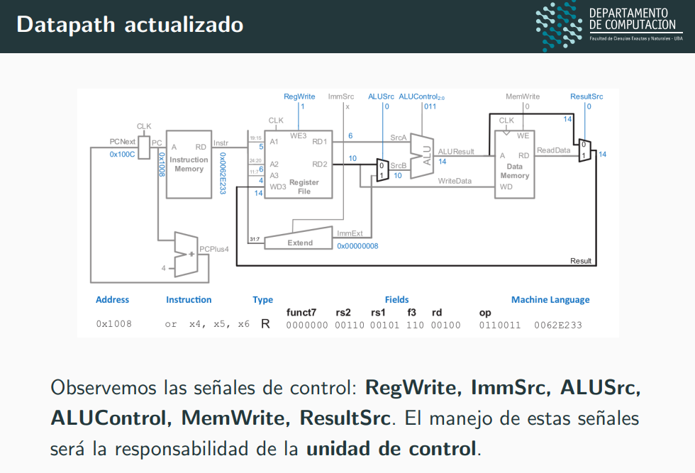
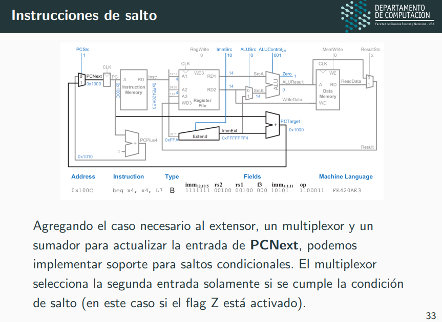
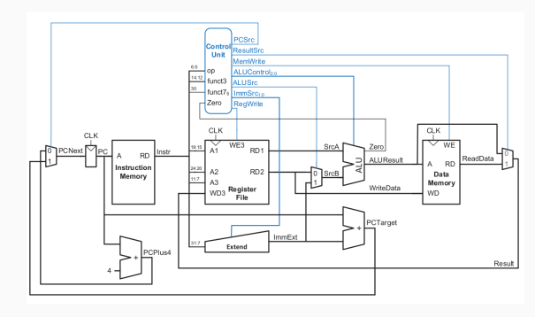

# Microarquitectura: 
Es la implementacion de los componentes, el camino de datos y la logica de control (implementacion en un soporte electronico).

Conceptualmente se ubica entre la arquitectura y la logica combinatoria y secuencial.

Implementa el soporte de estado arquitectonico y la logica de control para actualizar el estado segun lo que indica la semantica de las instrucciones de la ISA (Instruction Set Architecture).

Actualiza el estado de la arquitectura (el PC y los registros de proposito general). El estado de la arquitectura se refiere a los elementos de memoria expuestos a la persona que programa el sistema.

## Diseño de la microarquitectura
A la hora de justificar las decisiones de diseno e implementacion de una microarquitectura para RISCV, vamos a enfocarnos en un subconjunto de las instrucciones basicas:
- Registros: add, sub, and, or, slt
- Memoria: sw, lw
- Salto: beq

Un enfoque posible es comenzar presentando y vinculando a los elementos que realizaran transformaciones con los datos, a esto lo llamaremos el camino de datos o <b>datapath</b>.

Luego decidiremos como implementar la unidad que se asegura de
coordinar a los elementos del datapath para transformar a los
datos a partir de la manipulacion de sus senales de control, a esto
lo llamaremos <b>unidad de control</b>.

Los elementos de memoria del datapath son [4]:
- [1] <b>PC handler</b>: Recibe un CLOCK y el PCNext (futuro PC), devuelve el PC actual.
- [2] <b>Instruction Memory</b>: Toma una direccion A de 32 bits y vuelca la instruccion (otro valor de 32 bits) en esa posicion de memoria.
- [3] <b>Register File</b>: Contiene los 32 registros de la arquitectura. Tiene dos puertos de 5bits A1, A2 que indican los registros que salen por RD1 y R2 respectivamente. Ademas tiene una entrada de 32 bits WD3 y una entrada de 5 bits A3 que indica en que registro guardar el contenido que viene por WD3 cuando WE3 esta enabled. Tambien tiene una entrada de CLOCK.
- [4] <b>Data Memory</b>: Recibe una direccion A de 32 bits y devuelve el valor que se encuentra en esa posicion por la salida del RD si WE esta bajo. Si WE esta alto, entonces ingresa en esa posicion de memoria el contenido que le entra por WD. Tambien recibe un CLOCK.

Las instrucciones de mismo tipo tienen esquemas similares.

## Procesador de ciclo simple:
Las operaciones se completan durante un unico ciclo de reloj, por lo que la duracion del ciclo debe ser suficientemente larga como para permitir completar la operacion mas costosa (las que toma mas tiempo). 

Esto significa que el rendimiento del procesador no sera optimo pero resulta conveniente como ejemplo introductorio a las microarquitecturas.

Las instrucciones de RISC-V normalmente se ejecutan en un ciclo de reloj (ignorando cache misses), pero como vimos antes, tanto ARM-32 como x86-32 tienen instrucciones que llevan varios ciclos de reloj aun sin cache misses.

## Diseño incremental del DATAPATH
A los elementos de memoria se le incorpora:
- Extend: Recibe un inmediato de 12 bits y lo extiende a 32 bits.
- ALU 1. PC: Recibe un 4 y el PC y devuelve el PCNEXT.
- ALU 2. (entre RS1 y el inmediato extendido o un RS2): Recibe tambien un ALUControl que determinara la operacion entre los elementos.
- Multiplexor IMM vs RS2: Recibe un ALCSrc0 que determina si usa el inmediato o el rs2 como segunda entrada en la ALU  2. (que usa el RS1).
- Multiplexor entre la salida de la ALU 2. y la salida RD de la Data Memory. Es quien determina la entrada de WD3 en el Register File. Recibe tambien un ResultSrc.

## Datapath con instrucciones de salto

## Datapath con UC

