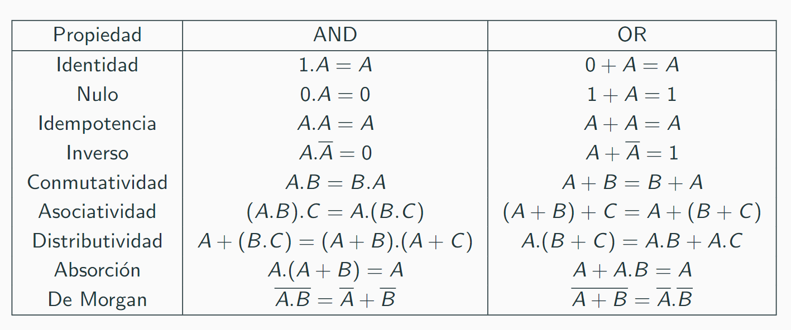

# Algebra de bool

### Notaciones:
AND $(.)$: `A.B == A && B`

OR $(+)$: `A+B == A or B`

### Axiomas (algunos)
$0.0 = 0$

$1.1 = 1$

$1.0 = 0.1 = 0$

$0+0 = 0$

$1+1 = 1$

$1+0 = 0+1 = 1$

### Propiedades 
