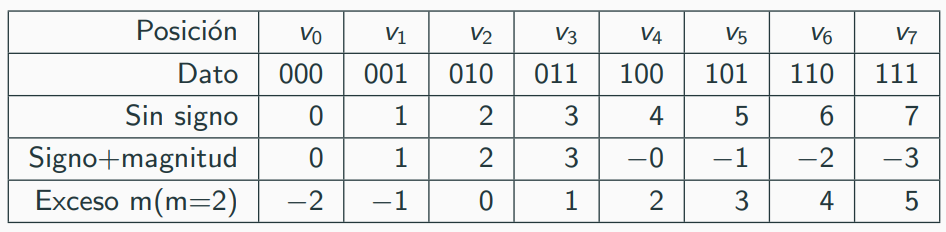

# Representacion de la informacion - Numeros enteros

Los datos tienen su informacion asociada y su tipo de dato.

En este caso la informacion asociada son los valores
de cada digito y el tipo de dato serian los naturales acotados.

El tipo nos indica como interpretar la informacion, en este caso como vincular el dato con una magnitud y que operaciones podemos realizar con ella.

## Tipos de datos para representar numeros enteros en base 2

1. **Sin signo**: Representa unicamente numeros positivos.
2. **Signo + magnitud**: Se usa el primer bit para indicar el signo de la magnitud.
3. **Exceso $m$**: Representacion simil a sin signo, donde el valor representado es el valor de la actual representacion - $m$.

4. **Complemento a 2**: Los positivos se representan igual a 'sin signo'. Para los negativos, si $n$ es la magnitud a representar y se representa por $D = (d_3,d_2,d_1,d_0)$, entonces invertimos todos los bits y al resultado le sumamos uno. 
Dada una $D$ de $n$ digitos ($d_i \in \{ 0,1 \}$), la magnitud representada es $$m= -2^{n-1} + \sum_{i=0}^{n-2} d_i 2^i$$

En todos ellos el rango se mantiene igual, porque el caso *distinto* tambien tiene dos opciones (separa en positivo y negativo), lo que cambia son las magnitudes asociadas a cada elemento (como los interpretamos).
