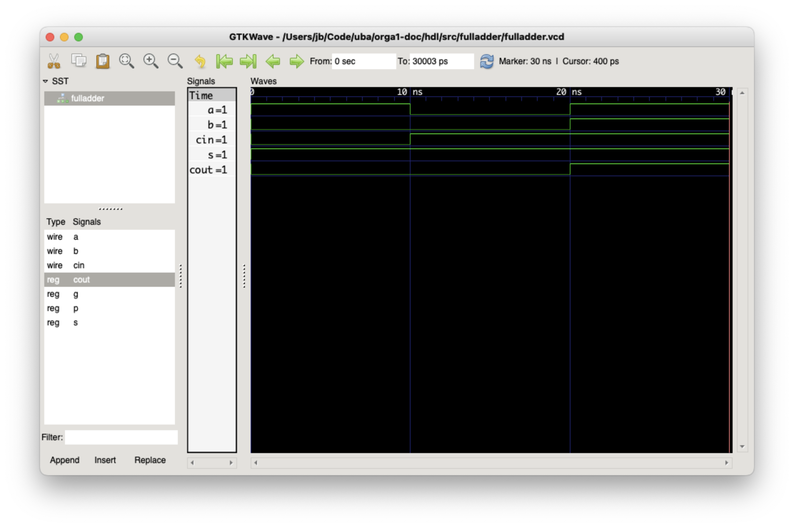
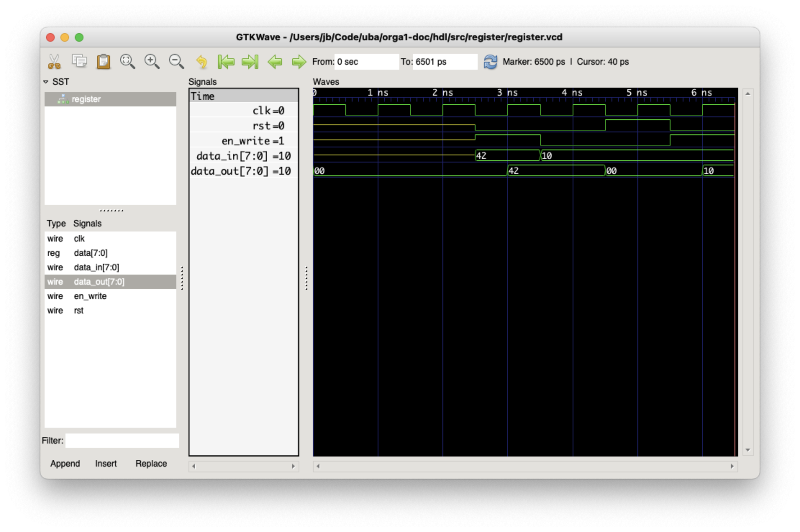

# Sistemas Digitales - HDL

## Herramientas

- [cocotb](https://www.cocotb.org/): Testbench en Python.
- [Icarus Verilog](https://steveicarus.github.io/iverilog/usage/installation.html): Simulador de Verilog.
- [GTKWave](https://gtkwave.sourceforge.net/): Visualizador de wavefiles.

## Setup

Las siguientes instrucciones son para instalar las herramientas en tu sistema **Linux** (testeado con Ubuntu 22.04).

### Python

Usamos Python para correr cocotb, una herramienta que permite testear los circuitos desde Python. Antes que nada, asegurate de tener instalado Python 3 en tu sistema.

```bash
python3 -V
```

Si te tira un error de que no está instalado, entonces deberías poder instalar Python así, o sino [fijate en la documentación oficial](https://www.python.org/).

```bash
sudo apt install python3
```

Por último, instalá estos paquetes que los vamos a usar más adelante.

```bash
sudo apt install python3-venv libpython3-dev
```

### Virtual environment

Vamos a crear un virtual environment (o "venv") de Python. Esto nos permite instalar paquetes/librerías de Python de formal local al proyecto en vez de global para todo tu sistema. Evita que distintos proyectos tengan conflictos por depender de distintas versiones de los mismos paquetes.

```bash
python3 -m venv venv
```

Hay que activar el virtual environment **cada vez** que trabajamos en el proyecto.

```bash
source venv/bin/activate
```

Si lo activaste exitosamente, vas a ver que se te agrega `(venv)` a la izquierda de todo del prompt de la terminal.

Por única vez, instalamos los paquetes de Python con pip.

```bash
pip install -r requirements.txt
```

Cuando termines de trabajar en el proyecto, podes desactivar el venv con este comando, o directamente cerrar la terminal.

```bash
deactivate
```

### Icarus Verilog

Este es el simulador de Verilog. Se encarga de "compilar" la definición de los circuitos y simularlos.

```bash
sudo apt install iverilog
```

### GTKWave

Esta herramienta (opcional pero muy útil) permite visualizar los "wavefiles" generados por los tests. Estos archivos contienen el diagrama de tiempo con todas las señales y permite debugear el comportamiento del circuito.

```bash
sudo apt install gtkwave
```

### Make

Quizás ya lo tienen instalado, pero por las dudas agregamos este comando así no tienen problemas al querer correr un `Makefile`.

```bash
sudo apt install make
```

## Simular un circuito

En la carpeta `src` hay 2 ejemplos de circuitos listos para ser simulados: un full adder y un registro de 8 bits con reset sincrónico.

Dentro de las carpetas de cada circuito (`src/fulladder` y `src/register`) van a encontrar la misma estructura de archivos (reemplazar `<module>` por el nombre del módulo):

- `<module>.sv`: El archivo de SystemVerilog con la definición del módulo.
- `test_<module>.py`: El testbench que corre con cocotb.
- `Makefile`: Para correr el testbench y generar el wavefile.

Para realizar la simulación, hay que pararse en la carpeta del módulo y ejecutar `make`. Si todo sale bien van a ver verde en la terminal de que pasaron todos los tests. Además, se van a generar algunos archivos, en particular un archivo `<module>.vcd`. Este es el wavefile que pueden abrirlo con GTKWave.

A continuación mostramos ejemplos de cómo se ve el output para cada circuito cuando pasan todos los tests. Sí, cocotb es un poco ruidoso e imprime muchas cosas en la pantalla. Hay que mirar con atención ya que cuando falla, entre todo ese texto están los mensajes de error.

### Full Adder

```bash
cd src/fulladder
make
```

```
rm -f results.xml
make -f Makefile results.xml
make[1]: Entering directory '/workspace/src/fulladder'
/usr/bin/iverilog -o sim_build/sim.vvp -D COCOTB_SIM=1 -s fulladder -f sim_build/cmds.f -g2012   /workspace/src/fulladder/fulladder.sv
rm -f results.xml
MODULE=test_fulladder TESTCASE= TOPLEVEL=fulladder TOPLEVEL_LANG=verilog \
         /usr/bin/vvp -M /workspace/venv/lib/python3.10/site-packages/cocotb/libs -m libcocotbvpi_icarus   sim_build/sim.vvp
     -.--ns INFO     gpi                                ..mbed/gpi_embed.cpp:105  in set_program_name_in_venv        Using Python virtual environment interpreter at /workspace/venv/bin/python
     -.--ns INFO     gpi                                ../gpi/GpiCommon.cpp:101  in gpi_print_registered_impl       VPI registered
     0.00ns INFO     cocotb                             Running on Icarus Verilog version 11.0 (stable)
     0.00ns INFO     cocotb                             Running tests with cocotb v1.8.1 from /workspace/venv/lib/python3.10/site-packages/cocotb
     0.00ns INFO     cocotb                             Seeding Python random module with 1716518317
     0.00ns INFO     cocotb.regression                  Found test test_fulladder.test_a_plus_b
     0.00ns INFO     cocotb.regression                  Found test test_fulladder.test_carry_in
     0.00ns INFO     cocotb.regression                  Found test test_fulladder.test_carry_out
     0.00ns INFO     cocotb.regression                  running test_a_plus_b (1/3)
VCD info: dumpfile fulladder.vcd opened for output.
    10.00ns INFO     cocotb.regression                  test_a_plus_b passed
    10.00ns INFO     cocotb.regression                  running test_carry_in (2/3)
    20.00ns INFO     cocotb.regression                  test_carry_in passed
    20.00ns INFO     cocotb.regression                  running test_carry_out (3/3)
    30.00ns INFO     cocotb.regression                  test_carry_out passed
    30.00ns INFO     cocotb.regression                  ***************************************************************************************
                                                        ** TEST                           STATUS  SIM TIME (ns)  REAL TIME (s)  RATIO (ns/s) **
                                                        ***************************************************************************************
                                                        ** test_fulladder.test_a_plus_b    PASS          10.00           0.00       4566.93  **
                                                        ** test_fulladder.test_carry_in    PASS          10.00           0.00      16832.76  **
                                                        ** test_fulladder.test_carry_out   PASS          10.00           0.00      24373.76  **
                                                        ***************************************************************************************
                                                        ** TESTS=3 PASS=3 FAIL=0 SKIP=0                  30.00           0.08        367.77  **
                                                        ***************************************************************************************

make[1]: Leaving directory '/workspace/src/fulladder'
```



### Register

```bash
cd src/register
make
```

```
rm -f results.xml
make -f Makefile results.xml
make[1]: Entering directory '/workspace/src/register'
mkdir -p sim_build
/usr/bin/iverilog -o sim_build/sim.vvp -D COCOTB_SIM=1 -s register -f sim_build/cmds.f -g2012   /workspace/src/register/register.sv
rm -f results.xml
MODULE=test_register TESTCASE= TOPLEVEL=register TOPLEVEL_LANG=verilog \
         /usr/bin/vvp -M /workspace/venv/lib/python3.10/site-packages/cocotb/libs -m libcocotbvpi_icarus   sim_build/sim.vvp
     -.--ns INFO     gpi                                ..mbed/gpi_embed.cpp:105  in set_program_name_in_venv        Using Python virtual environment interpreter at /workspace/venv/bin/python
     -.--ns INFO     gpi                                ../gpi/GpiCommon.cpp:101  in gpi_print_registered_impl       VPI registered
     0.00ns INFO     cocotb                             Running on Icarus Verilog version 11.0 (stable)
     0.00ns INFO     cocotb                             Running tests with cocotb v1.8.1 from /workspace/venv/lib/python3.10/site-packages/cocotb
     0.00ns INFO     cocotb                             Seeding Python random module with 1716518907
     0.00ns INFO     cocotb.regression                  Found test test_register.test_register
     0.00ns INFO     cocotb.regression                  running test_register (1/1)
VCD info: dumpfile register.vcd opened for output.
     6.50ns INFO     cocotb.regression                  test_register passed
     6.50ns INFO     cocotb.regression                  **************************************************************************************
                                                        ** TEST                          STATUS  SIM TIME (ns)  REAL TIME (s)  RATIO (ns/s) **
                                                        **************************************************************************************
                                                        ** test_register.test_register    PASS           6.50           0.01       1265.06  **
                                                        **************************************************************************************
                                                        ** TESTS=1 PASS=1 FAIL=0 SKIP=0                  6.50           0.09         68.56  **
                                                        **************************************************************************************

make[1]: Leaving directory '/workspace/src/register'
```


